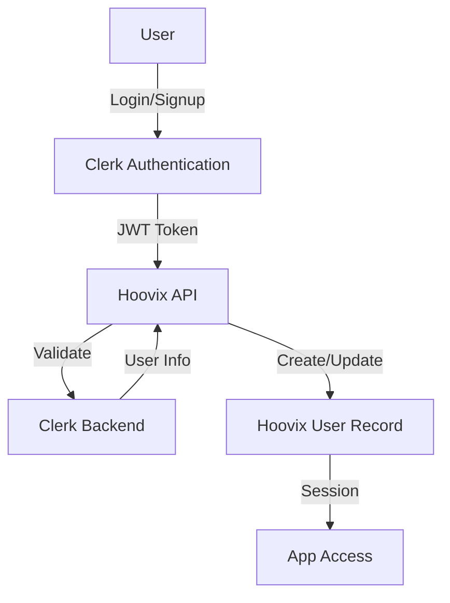
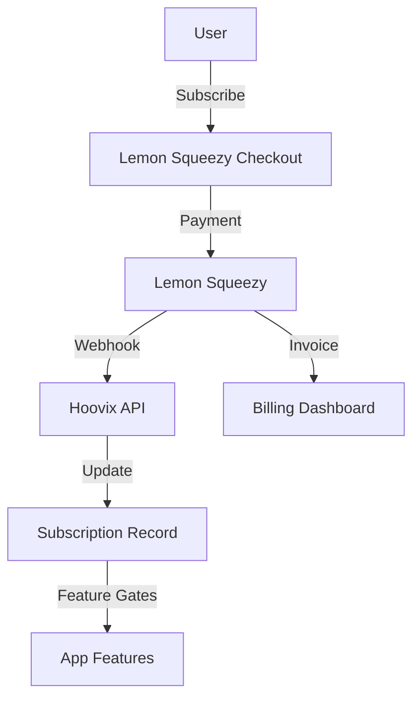
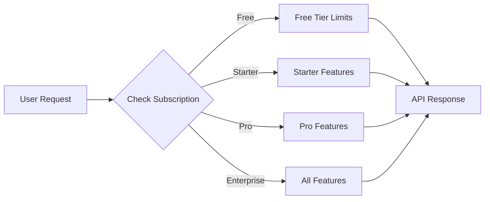

# Hoovix SaaS Transformation Architecture

## Overview

Hoovix is a modern project management platform competing with Jira, Linear, Monday, and ClickUp. This document outlines the comprehensive architecture for transforming it into a viable SaaS product with Clerk authentication and Lemon Squeezy payments.

## Current Architecture Analysis

### Tech Stack
- **Frontend**: React Router v7, TypeScript, Tailwind CSS, MobX
- **Backend**: Python (API layer)
- **State Management**: MobX stores in `packages/shared-state`
- **UI Components**: `@plane/ui` package with Storybook
- **Authentication**: Custom auth (email/password, OAuth via GitHub/GitLab/Google)
- **Monorepo**: Turborepo with pnpm workspaces

### Existing Apps
- `apps/web` - Main application (port 3000)
- `apps/admin` - Admin panel (port 3001)
- `apps/space` - Public workspace views
- `apps/api` - Backend API
- `apps/live` - Real-time collaboration

## Proposed SaaS Architecture

### 1. Authentication Layer (Clerk Integration)



**Implementation Details:**
- Replace custom auth with `@clerk/clerk-react`
- Use Clerk's `<SignIn />` and `<SignUp />` components
- Map Clerk `user_id` to internal user records
- Support social providers: Google, GitHub, Microsoft
- Enable MFA and session management
- Webhook handling for user events

### 2. Payment Layer (Lemon Squeezy Integration)



**Implementation Details:**
- Use `@lemonsqueezy/lemonsqueezy.js` SDK
- Webhook endpoints for subscription events
- Metered billing for usage-based features
- Customer portal for billing management
- Trial period handling (14-day default)

### 3. Feature Gating System



## Monetization Plans

### Free Tier (Individual)
- **Price**: $0/month
- **Projects**: Up to 3
- **Team Members**: 1 (solo)
- **Storage**: 1 GB
- **Features**:
  - Basic task management
  - Kanban and List views
  - Basic search
  - Email notifications
  - 7-day activity history

### Starter Plan (Small Teams)
- **Price**: $12/user/month
- **Projects**: Unlimited
- **Team Members**: Up to 10
- **Storage**: 10 GB per user
- **Features**:
  - All Free features
  - Sprint planning
  - Cycle management
  - Basic analytics
  - GitHub/GitLab integration
  - Slack notifications
  - 30-day activity history
  - Priority email support

### Pro Plan (Growing Teams)
- **Price**: $24/user/month
- **Projects**: Unlimited
- **Team Members**: Unlimited
- **Storage**: 50 GB per user
- **Features**:
  - All Starter features
  - Advanced analytics & reporting
  - Custom workflows
  - Time tracking
  - Bulk operations
  - Public views & pages
  - API access (10,000 calls/month)
  - Advanced integrations (Zapier, Notion)
  - 90-day activity history
  - Priority chat support

### Enterprise Plan (Organizations)
- **Price**: Custom ($49+/user/month)
- **Projects**: Unlimited
- **Team Members**: Unlimited
- **Storage**: Unlimited
- **Features**:
  - All Pro features
  - SSO/SAML (via Clerk)
  - Advanced security controls
  - Audit logs
  - Dedicated account manager
  - Custom onboarding
  - SLA guarantee (99.9% uptime)
  - Unlimited API access
  - Unlimited activity history
  - 24/7 phone support
  - Custom integrations

## Database Schema Updates

### New Tables

```sql
-- Subscriptions table
CREATE TABLE subscriptions (
    id UUID PRIMARY KEY DEFAULT gen_random_uuid(),
    user_id UUID REFERENCES users(id),
    lemon_squeezy_id VARCHAR(255) UNIQUE,
    lemon_squeezy_customer_id VARCHAR(255),
    status VARCHAR(50), -- active, cancelled, past_due, etc.
    plan_id VARCHAR(50), -- free, starter, pro, enterprise
    current_period_start TIMESTAMP,
    current_period_end TIMESTAMP,
    cancel_at_period_end BOOLEAN DEFAULT false,
    trial_ends_at TIMESTAMP,
    created_at TIMESTAMP DEFAULT NOW(),
    updated_at TIMESTAMP DEFAULT NOW()
);

-- Subscription events log
CREATE TABLE subscription_events (
    id UUID PRIMARY KEY DEFAULT gen_random_uuid(),
    subscription_id UUID REFERENCES subscriptions(id),
    event_type VARCHAR(100),
    payload JSONB,
    created_at TIMESTAMP DEFAULT NOW()
);

-- Feature usage tracking
CREATE TABLE feature_usage (
    id UUID PRIMARY KEY DEFAULT gen_random_uuid(),
    user_id UUID REFERENCES users(id),
    workspace_id UUID REFERENCES workspaces(id),
    feature_name VARCHAR(100),
    usage_count INTEGER DEFAULT 0,
    usage_date DATE DEFAULT CURRENT_DATE,
    created_at TIMESTAMP DEFAULT NOW(),
    UNIQUE(user_id, workspace_id, feature_name, usage_date)
);

-- Clerk user mapping
ALTER TABLE users ADD COLUMN clerk_user_id VARCHAR(255) UNIQUE;
ALTER TABLE users ADD COLUMN auth_provider VARCHAR(50) DEFAULT 'clerk';
```

## API Changes

### New Endpoints

```typescript
// Authentication
POST /api/auth/clerk/callback    // Clerk webhook handler
GET  /api/auth/session           // Get current session
POST /api/auth/sync              // Sync Clerk user to Hoovix

// Billing
GET  /api/billing/subscription   // Get current subscription
POST /api/billing/checkout       // Create checkout session
POST /api/billing/portal         // Create customer portal session
GET  /api/billing/invoices       // Get invoice history
POST /api/billing/webhook        // Lemon Squeezy webhook

// Usage
GET  /api/usage                  // Get usage statistics
GET  /api/usage/limits           // Get plan limits
```

## Frontend Changes

### New Components

```typescript
// Authentication
<ClerkAuthProvider />
<SignInPage />
<SignUpPage />
<UserButton />

// Billing
<BillingPage />
<SubscriptionCard />
<PlanSelector />
<CheckoutModal />
<UsageMeter />

// Feature Gates
<FeatureGate feature="time-tracking">
  <TimeTrackingComponent />
</FeatureGate>
<UpgradePrompt feature="advanced-analytics" />
```

### Route Protection

```typescript
// Protected routes with subscription checks
const routes = [
  {
    path: "/",
    element: <AuthenticatedLayout />,
    loader: checkSubscriptionLoader,
    children: [
      { path: "billing", element: <BillingPage /> },
      { path: "settings", element: <SettingsPage /> },
    ]
  }
];
```

## UI/UX Improvements

### 1. Landing Page Redesign
- Modern hero section with product demo
- Clear pricing table
- Feature comparison
- Testimonials section
- CTA buttons for each plan

### 2. Onboarding Flow
- Welcome wizard post-signup
- Workspace creation guide
- Team invitation flow
- Quick tutorial overlay

### 3. Dashboard Enhancements
- Customizable widgets
- Quick actions panel
- Recent activity feed
- Upgrade prompts (non-intrusive)

### 4. Navigation Improvements
- Collapsible sidebar
- Command palette (Cmd+K)
- Breadcrumb navigation
- Recent items quick access

### 5. Dark Mode Polish
- Consistent color palette
- High contrast mode
- System preference detection
- Smooth theme transitions

## Feature Enhancements

### 1. AI-Powered Features (Pro+)
- Task description auto-completion
- Sprint velocity prediction
- Smart task categorization
- Automated standup summaries

### 2. Advanced Integrations
- GitHub/GitLab deep linking
- Slack/Discord notifications
- Zapier/Make.com support
- Custom webhook support

### 3. Collaboration Tools
- Real-time cursors
- @mentions with notifications
- Threaded comments
- Document co-editing

### 4. Reporting & Analytics
- Burndown/burnup charts
- Velocity tracking
- Cycle time analysis
- Custom report builder

## Deployment Configuration

### Coolify Setup

```yaml
# docker-compose.coolify.yml
version: '3.8'
services:
  web:
    build:
      context: .
      dockerfile: apps/web/Dockerfile
    environment:
      - VITE_CLERK_PUBLISHABLE_KEY=${CLERK_PUBLISHABLE_KEY}
      - CLERK_SECRET_KEY=${CLERK_SECRET_KEY}
      - LEMONSQUEEZY_API_KEY=${LEMONSQUEEZY_API_KEY}
      - LEMONSQUEEZY_WEBHOOK_SECRET=${LEMONSQUEEZY_WEBHOOK_SECRET}
    ports:
      - "3000:3000"
  
  api:
    build:
      context: ./api
    environment:
      - DATABASE_URL=${DATABASE_URL}
      - CLERK_SECRET_KEY=${CLERK_SECRET_KEY}
      - LEMONSQUEEZY_API_KEY=${LEMONSQUEEZY_API_KEY}
    ports:
      - "8000:8000"
```

### Environment Variables

```bash
# Clerk
CLERK_PUBLISHABLE_KEY=pk_test_...
CLERK_SECRET_KEY=sk_test_...
CLERK_WEBHOOK_SECRET=whsec_...

# Lemon Squeezy
LEMONSQUEEZY_API_KEY=...
LEMONSQUEEZY_STORE_ID=...
LEMONSQUEEZY_WEBHOOK_SECRET=...

# Database
DATABASE_URL=postgresql://...

# App
APP_URL=https://hoovix.com
API_URL=https://api.hoovix.com
```

## Implementation Phases

### Phase 1: Foundation (Weeks 1-2)
- [ ] Set up Clerk authentication
- [ ] Replace existing auth flows
- [ ] Update user model with Clerk mapping
- [ ] Test authentication flows

### Phase 2: Payments (Weeks 3-4)
- [ ] Integrate Lemon Squeezy
- [ ] Create subscription plans
- [ ] Build billing dashboard
- [ ] Implement webhooks

### Phase 3: Feature Gating (Weeks 5-6)
- [ ] Define feature limits per plan
- [ ] Implement usage tracking
- [ ] Create feature gate components
- [ ] Add upgrade prompts

### Phase 4: UI/UX (Weeks 7-8)
- [ ] Redesign landing page
- [ ] Improve onboarding
- [ ] Polish dashboard
- [ ] Add dark mode enhancements

### Phase 5: Advanced Features (Weeks 9-10)
- [ ] AI integrations
- [ ] Advanced analytics
- [ ] Custom integrations
- [ ] Performance optimization

### Phase 6: Launch Prep (Weeks 11-12)
- [ ] Security audit
- [ ] Performance testing
- [ ] Documentation
- [ ] Deploy to production

## Success Metrics

- **User Acquisition**: 1000 signups in first month
- **Conversion Rate**: 5% free to paid
- **Churn Rate**: <5% monthly
- **NPS Score**: >50
- **Uptime**: 99.9%

## Risk Mitigation

1. **Data Migration**: Gradual rollout with data backup
2. **Performance**: Load testing before launch
3. **Security**: Regular security audits
4. **Support**: Comprehensive documentation and support channels
